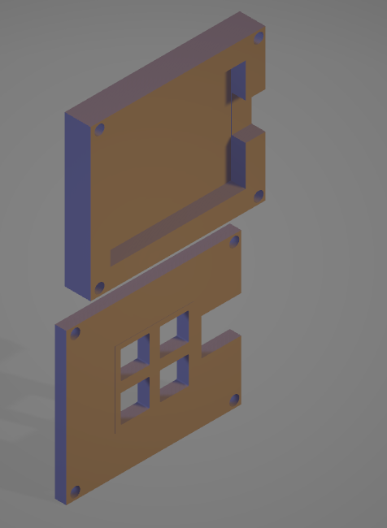
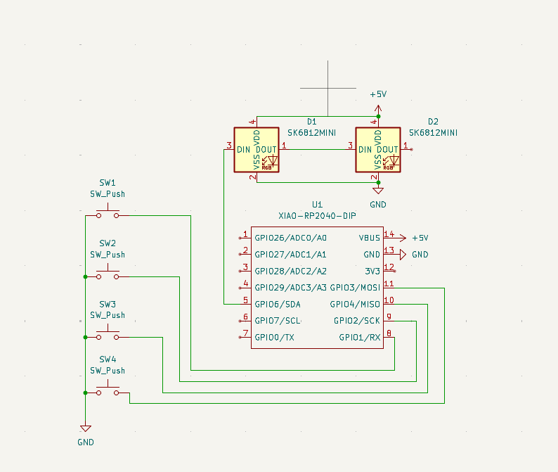
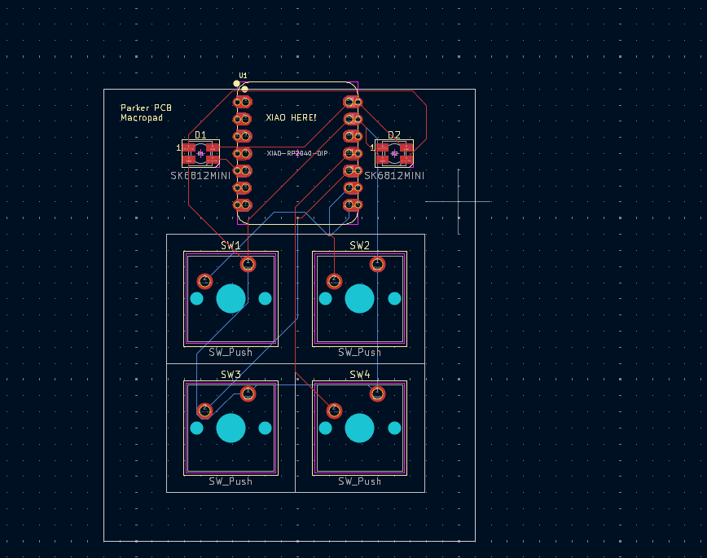

# Parker Macropad
Finished your macropad? Congrats! This is my custom macropad project.

---

### Inspiration

The **Parker Macropad** is a compact 4-key macropad built around the XIAO RP2040.  
The goal was to design a clean, minimal macropad with fully custom hardware, including the PCB and enclosure.

---

### Challenges

The **biggest challenge** in this project was developing and configuring the **firmware** for the macropad.

While the PCB layout and schematic design went relatively smoothly, getting the firmware to correctly detect key presses, map inputs, and reliably flash to the RP2040 took the most time. Debugging pin assignments and understanding how the microcontroller handled inputs was a major learning experience.

This project helped me gain hands-on experience with **keyboard firmware, RP2040 microcontrollers, and embedded systems debugging**.

---

### Specifications

**BOM:**
- 4× Cherry MX Switches  
- 2× SK6812 MINI LEDs  
- 1× XIAO RP2040  
- 4× Blank DSA Keycaps  
- 4× M3×16 Bolts  
- 4× M3 Heat-set Inserts  

**Others:**
- Custom PCB  
- 3D-Printed Top Case  
- 3D-Printed Bottom Case  

---

### Design Files

Schematic | PCB | Case
:-------------------------:|:-------------------------:|:-------------------------:
 |  | 

